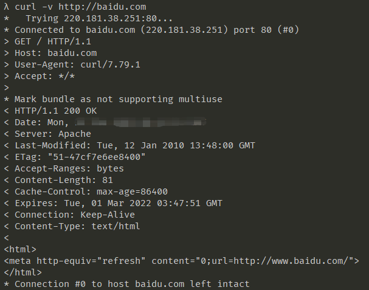

# HTTP
HTTP（Hyper Text Transfer Protocol）直译超文本传输协议。

## curl 命令
* 用 curl 可以发送HTTP请求。
  1. 如：curl -v http://baidu.com

* 理解以下概念：
  1. url会被curl重写，先请求DNS获得IP。
  2. 进行TCP连接，TCP连接成功后，开始发送HTTP请求。
  3. 前缀为“>”的内容是请求内容。
  4. 前缀为“<”的内容是响应内容。
  5. 响应结束后关闭TCP连接。（代码中没有显示）
  6. 结束。

