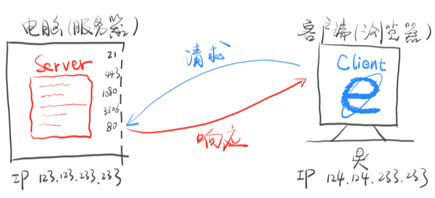
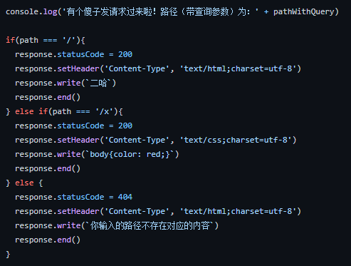

<!--  -->
# HTTP
HTTP（Hyper Text Transfer Protocol）直译超文本传输协议。

学习HTTP，要掌握基础概念、如何调试（如Node.js）、哪里查资料，以及标准文档（HTTP规格文档：RFC 2616等）。

## curl 命令
* 用 curl 可以发送HTTP请求。
  1. 如：curl -v <a>http://baidu.com</a>

* 理解以下概念：
  1. url会被curl重写，先请求DNS获得IP。
  2. 进行TCP连接，TCP连接成功后，开始发送HTTP请求。
  3. 前缀为“>”的内容是请求内容。
  4. 前缀为“<”的内容是响应内容。
  5. 响应结束后关闭TCP连接。（代码中没有显示）
  6. 结束。

## HTTP请求与响应

发送请求：可以使用curl命令简单地发送请求测试。协助用户发送请求的工具叫做“用户代理”(Uer Agent)。

做出响应：Node.js 有个http模块可以简单做到。

* 以上举例了服务器响应代码。
* path 指不带查询参数地路径。
* response 是请求对象。
* 以上有两种字符串写法：1. `...`，这样写，在里边输入回车是会生效的。2. '...'，这样写，直接回车无效，需要用 \n 表示回车。
* response.write() 可以填写返回的内容。
* response.end() 表示响应可以发给用户了。
* <strong>注意：URL中的后缀是无效的，.../y.css 不一定是CSS内容。Content-Type=>类型/语法 才是决定文件类型的关键。</strong>

## HTTP 基础概念
### 请求
包括三部分（不算回车），可以参考 <a href="https://www.w3.org/Protocols/rfc2616/rfc2616-sec5.html">RFC 2616 第五章</a>：
1. 请求行：请求动词（GET/POST/PUT等）+路径和查询参数+协议名/版本
2. 请求头：
    
    Host: 域名或IP
    
    Accept: text/html
    
    Content-Type: 请求体的格式

3. 回车隔开
4. 请求体：请求体在GET请求中一般为空

### 响应
  
包括三部分（不算回车），<a href="https://www.w3.org/Protocols/rfc2616/rfc2616-sec6.html">RFC 2616 第五章</a>：
1. 状态行：协议名/版本+状态码+状态字符串
2. Content-Type: 响应体的格式
3. 回车隔开
4. 响应体

常见状态码是前端<strong>考点</strong>。

### 构造请求和响应
* 用 curl 构造请求
  curl -v <a>http://127.0.0.1:8888</a>
  1. 设置请求动词：-X POST/GET（默认GET）
  2. 设置路径和查询参数：直接加在 url 后面
  3. 设置请求头：-H/--header 'Name: Value'
  4. 设置请求体：-d/--data '内容'

* 用 Node.js 读取请求
  1. 读取请求动词：request.method
  2. 读取路径：
      
      request.url 路径，带查询参数
      
      request.path 路径
      
      request.query 查询参数
  3. 读取请求头：request.headers['accept']
  4. 读取请求体

* 用 Node.js 设置响应
  1. 设置响应状态码：response.statusCode = XXX
  2. 设置响应头：response.setHeader('Content-Type','text/html')
  3. 设置响应体：response.write('内容')，这个方法可以多次调用，实现追加内容的效果。

* <strong>使用 console.log 来调试程序</strong>

### 常见 Http 状态码
<a href='https://www.cnblogs.com/XF-eng/p/14080968.html'>参考文章链接</a>。

状态码数字中的第一位指定了响应的类别，后两位无分类。响应类别有一下五种：
* 1xx ：接收的请求正在处理
* 2xx ：请求正常处理完毕
* 3xx ：需要进行附加操作已完成请求
* 4xx ：服务器无法处理请求
* 5xx ：服务器处理请求出错

1. 2xx 成功
    * 200 OK: 表示从客户端发送过来的请求在服务器端被正常处理了。
    * 204 no content: 该状态码表示服务器成功处理了接收的请求，但在返回的响应报文中不含实体的主体部分。

2. 3xx 重定向
    * 301 Moved Permanently: 永久重定向，新的资源在响应头的Location字段里面。
    * 302 Found：临时重定向。与301不同是，302状态码表示的资源不是被永久移动，只是临时性质的。比如用户中心的登录界面就可以使用302，因为用户对登录界面的使用通常是临时的。

3. 4xx 客户端错误
    * 400 Bad Request：该状态码表示请求报文中存在语法错误，需修改请求的内容后再次发送请求。
    * 401 Unauthorized：该状态码表示发送的请求需要有通过Http认证的认证信息。
    * 403 Forbidden：该状态码表明请求资源的访问被服务器拒绝了，通常是因为没有权限访问该服务器。
    * 404 Forbidden：该状态码表明服务器没有找到请求的资源。

4. 5xx 服务器错误
    * 500 Internal Serve Error：服务器端在执行请求时发生了错误，也有可能是web应用存在的bug或者某些临时故障。
    * 503 Service Unavailable：该状态码表示服务器暂时处于超负载或正在停机维护，现在无法处理请求。
  

