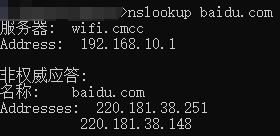

<!-- 02.26: 0.5h 02.28: 2h -->
# 浅析 URL
Lee爵士发明了三样东西：WWW=URL+HTTP+HTML。HTML+CSS本质就是网页。

URL(Uniform Resource Locator)=

协议+域名/IP+端口号+路径+查询参数+锚点

## IP
先从IP讲起，IP全称 Internet Protocol，主要约定了两件事：1. 如何定位一台设备；2. 如何封装数据报文来和其他设备交流。这里主要讲述第1点。

你访问某个网站时对应了哪个IP？可以用 ping 命令来查询。如上图所示，那么“域名”为 baidu.com ，它对应的IP就是：220.181.38.148。注意，每个人访问相同的网站时对应的IP可以是不一样的，详情见<a href="#domainName">域名</a>部分。

## IP分为内网和外网

### 如何获取外网IP：
* 你从电信租用带宽，一年一千多。
* 你买了个路由器，然后用电脑和手机分别连接路由器广播出来的无限WIFI。
* 只要路由器脸上了电信的服务器，那么路由器就会被分配到一个“外网IP”，而这个外网IP就是你在互联网中的地址。
* 如果重启路由器，那么这个外网IP地址会被重新分配，因此重启后的外网IP地址很可能会和之前的不一样。
* 手机和电脑用的是相同的外网IP地址，但是使用不同的内网IP地址。

### 内网IP：
* 路由器会在你家创建一个内网，一般这个IP的格式都是：192.168.XXX.XXX。
* 路由器会给自己分配一个内网IP，可以通过cmd查询：输入命令 ipconfig → WLAN（电脑无限连接WiFi时）里边的“默认网关”就是路由器内网地址。

### 路由器功能：
* 拥有一个外网IP和内网IP。
* 内网中的设备可以相互访问，而无法直接访问外网。
* 内网中的设备经过路由器中转来访问外网。
* 外网中的设备可以互相访问，但无法直接访问你的内网。
* 类似地，外网地设备需要经过路由器中转来访问你使用的内网。
* 内网和外网可以说是隔绝的，只能通过路由器实现联通。
* 路由器有时候也被称作“网关”。

### 特殊IP
* 127.0.0.1 | localhost，指代自己这个IP。
* 0.0.0.0，不表示任何设备。

## port 端口
IP+port就能够定位一台设备对应的服务。<strong>IP和port缺一不可。</strong>
* 要点
  1. 要提供HTTP服务最好使用80端口。
  2. 要提供HTTPS服务最好使用443端口。
  3. 要提供FTP服务最好使用21端口。（12年左右大学普遍使用的校园网是FTP服务）
  4. 一共有65535个端口。（眼下来说基本够用）
  5. 更多默认端口服务信息可以查询<a href="https://zh.wikipedia.org/wiki/TCP/UDP%E7%AB%AF%E5%8F%A3%E5%88%97%E8%A1%A8#0.E5.88.B01023.E5.8F.B7.E7.AB.AF.E5.8F.A3" target="_blank">wiki</a>。
  6. 端口号 0~1023 是留给系统使用的，使用管理员权限后，这些端口才能被使用。
  7. 一个端口被占用了，那么你只能用另一个端口。

## 

域名/IP
域名是IP的别称。
* 要点
  1. 一个域名可以对应不同的IP，这种现象源于负载均衡。
  2. 一个IP也可以有不同的域名，这叫做共享主机，比如，一些穷开发者就会和别人共用一个IP。

* nslookup 命令
可以用这个命令来查询一个域名对应哪些IP。

### DNS（Domain Name System）
域名和IP通过DNS对应起来。
* 举例：
  1. 输入xxx.com。
  2. 浏览器就会向电信/联通的DNS服务器询问xxx.com对应的IP。
  3. 电信/联通会回应一个IP给浏览器。
  4. 浏览器得到IP，才会向对应IP的80/443端口发送请求。

* 题外话：
<a>www.xxx.com</a> 和 xxx.com 是同一个域名吗？回答“不是”。
  1. com是顶级域名。
  2. xxx.com 是二级域名，或俗称 一级域名。
  3. <a>www.xxx.com</a> 是三级域名，或俗称 二级。

## 路径
网址中，域名、端口后面接着路径，通过这个路径来请求不同的页面。

## 查询参数
相同的域名、端口、路径，传递不同的参数，显示不同的页面内容。

## 锚点
锚点用来访问同个页面中不同的位置。
* 注意：
  1. 锚点在浏览器网址中看起来可以有中文，实际不支持中文。
  2. <strong>锚点不会传给服务器。</strong>

